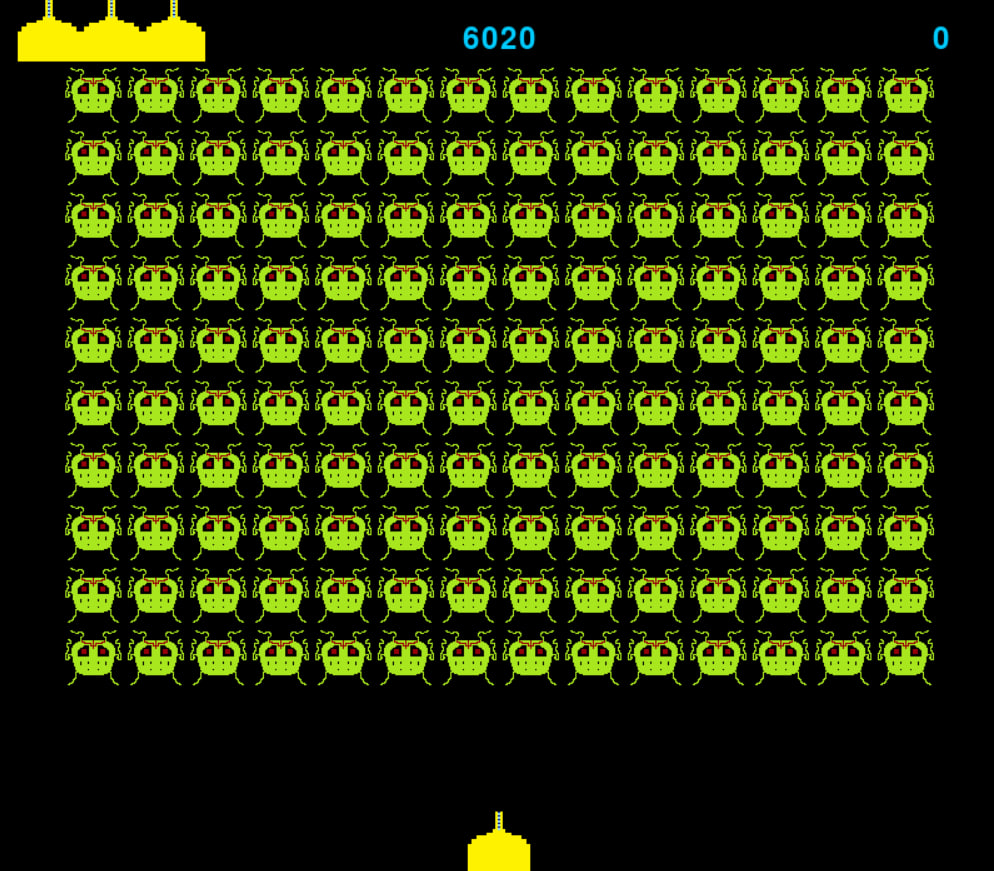

  
  <h2 align="center">🚀Space Defenders👾</h2>

<h2>
💥Знищуй прибульців, доки вони не знищили ТЕБЕ!💥
</h2>
<table>
    <td>
      
    </td>
    <td>
      

        <h2>
        Це 2D гра в якій ви керуєте косвічним  літаком та знищуєте прибульців. 
        Ви можете переглядати таблицю лідерів  та змагатись із іншими гравцями на локальному рівні. 
        Вам потрібно зареєструватись/авторизуватись  для входу в меню, де перед вами буде список 
        з можливостей, а саме: почати гру, таблиця лідерів,  інстрекція, де ви зможете ознайомитись із корстуванням гри, про гру. 
        </h2>
      

    </td>
</table>

# Технології
<table>
  <tr>
    <td>Мова</td>
    <td>Python </td>
  </tr>
  <tr>
    <td>База даних</td>
    <td>SQLite</td>
  </tr>
  <tr>
    <td>Принципи</td>
    <td>OOP</td>
  </tr>
</table>

# Інсталяція
Відкрийте термінал у тій дерикторії де ви хочете встановити гру та пропиціть наступні команди: 
1) `git clone https://github.com/kulidaden/Space_Game.git`
2) `cd Space_Game`
3) `pip install -r requirements.txt`
4) `pyinstaller --onefile --distpath ./ DataBase.py`
5) `./DataBase.exe`

## 

  
  <h2 align="center">🚀Space Defenders👾</h2>

<h2>
💥Destroy the aliens until they destroy YOU!💥
</h2>
<table>
    <td>
      
    </td>
    <td>
      

        <h2>
          This is a 2D game in which you control an indirect plane and destroy aliens. 
          You can view leaderboards and compete with other players locally. 
          You need to register/authenticate to enter the menu, 
          where you will have a list of options, namely: start the game,  
          leaderboard, instructions, where you can familiarize yourself with the game, about the game.
        </h2>
      

    </td>
</table>

# Knowledges
<table>
  <tr>
    <td>Language</td>
    <td>Python</td>
  </tr>
  <tr>
    <td>Data Base</td>
    <td>SQLite</td>
  </tr>
  <tr>
    <td>Principles</td>
    <td>OOP</td>
  </tr>
</table>

## Installation:
Open a terminal in the directory where you want to install the game and type the following commands:
1) `git clone https://github.com/kulidaden/Space_Game.git`
2) `cd Space_Game`
3) `pip install -r requirements.txt`
4) `pyinstaller --onefile --distpath ./ DataBase.py`
5) `./DataBase.exe`
