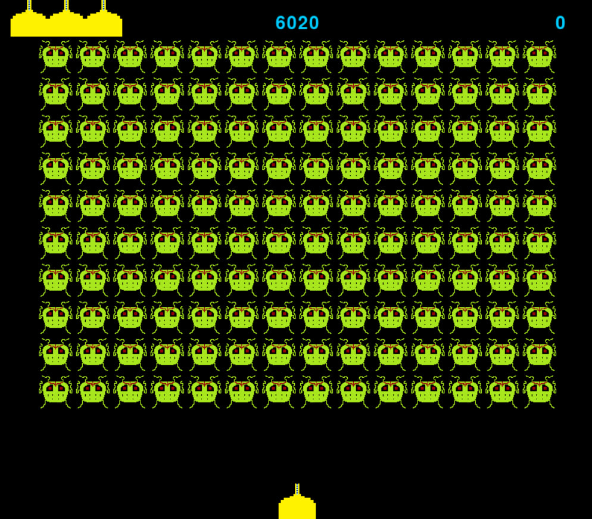

  

  
  <h2 align="center">🚀Space Defenders👾</h2>

# 
💥 Знищуй прибульців, доки вони не знищили ТЕБЕ! 💥

<table>
  <tr>
    <td>
      
    </td>
    <td>
      

        Це 2D гра в якій ви керуєте косвічним літаком та знищуєте прибульців. Ви можете переглядати таблицю лідерів та змагатись із іншими гравцями на локальному рівні.
Вам потрібно зареєструватись/авторизуватись для входу в меню, де перед вами буде список з можливостей, а саме: почати гру, таблиця лідерів, інстрекція, де ви зможете ознайомитись із корстуванням гри, про гру.
      

    </td>
  </tr>
</table>

# Інсталяція
Відкрийте термінал у тій дерикторії де ви хочете встановити гру та пропиціть наступні команди: 
1) `git clone https://github.com/kulidaden/Space_Game.git`
2) `cd Space_Game`
3) `pip install -r requirements.txt`
4) `pyinstaller --onefile --distpath ./ DataBase.py`
5) `./DataBase.exe`

## Name and description of the game
Title "Space Defenders"

## 
This is a 2D game in which you control an indirect plane and destroy aliens.  You can view leaderboards and compete with other players locally.  You need to register/authenticate to enter the menu, where you will have a list of options, namely: start the game, leaderboard, instructions, where you can familiarize yourself with the game, about the game.

## Installation:
Open a terminal in the directory where you want to install the game and type the following commands:
1) `git clone https://github.com/kulidaden/Space_Game.git`
2) `cd Space_Game`
3) `pip install -r requirements.txt`
4) `pyinstaller --onefile --distpath ./ DataBase.py`
5) `./DataBase.exe`
